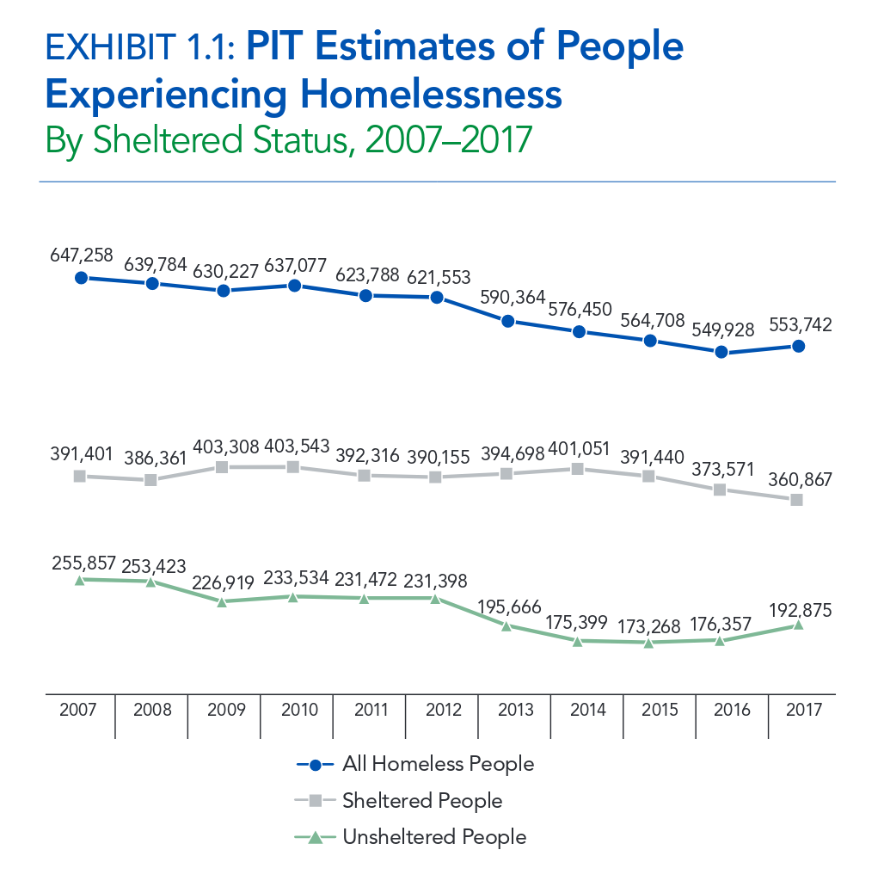
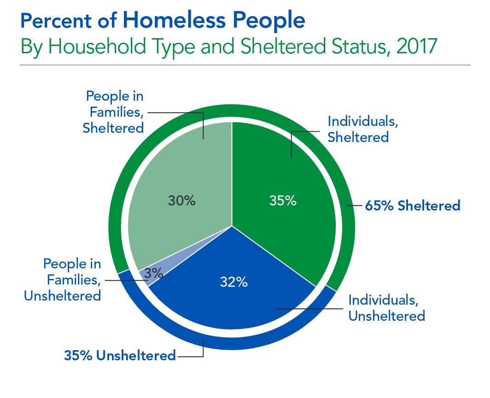
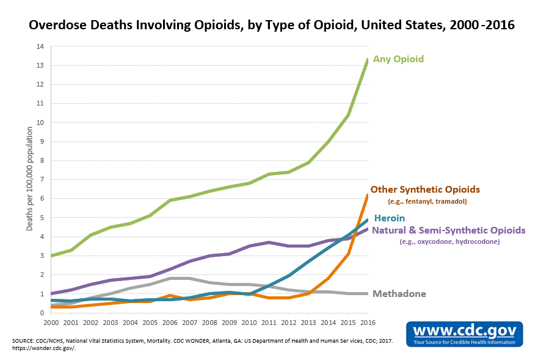

```{r setup, include=FALSE}
knitr::opts_chunk$set(echo = FALSE)
```

## TODO

- Papa smurf page and images
- Overdose deaths from opiates
- Overdose death increase from fentynal
- page on "is the reduction in homelessness due to overdoses"
- review of causality
- is the affordability issue in LA due to the sanctuary city status?
- Look into scraping this data table (https://www.cdc.gov/drugoverdose/data/heroin.html)

## Reason

1. Demonstrate the use of R, RStudio and RMarkdown
2. I feel that it is important for all of use to questions our assumptions using the latest data
- (otherwise, you inevitably come to the conclusion that all Smurfs are Evil based on the rascally Papa Smurf)
- TODO Papa Smurf image
3. I feel that it is incumbent on the older, most experienced, members of the LUG to help mold the younger or less experienced by presenting relevant information to the group.
4. Phill's work problem is quite interesting
5. Stay sharp

## Resources

- [RStudio](https://www.rstudio.com/)
- [RMarkdown](https://rmarkdown.rstudio.com/)
- [RMarkdown Reference](https://www.rstudio.com/wp-content/uploads/2015/03/rmarkdown-reference.pdf)
- [RMarkdown Cheatsheet](http://www.rstudio.com/wp-content/uploads/2016/03/rmarkdown-cheatsheet-2.0.pdf)

## Rates of Homelessness (U.S.)

Sources:

- [The 2017 Annual Homeless Assessment Report to Congress](https://www.hudexchange.info/resources/documents/2017-AHAR-Part-1.pdf)
- [The U.S. Conference of Mayors' Report on Hunger and Homelessness](https://endhomelessness.atavist.com/mayorsreport2016)

## Rates of Homelessness (U.S.) - Original Line Chart



## Rates of Homelessness (U.S.) - Line Chart in R

```{r, echo = TRUE}
year <- 2007:2017
num.homeless <- c(647258, 639784, 630227, 637077, 623788, 621553, 
                  590364, 576450, 564708, 549928, 553742)
```

- I harvested this data using by simply copying the numbers from the chart
- The image on the previous slide includes data from 2007 to 2016
- A keyboard macro in Emacs quickly transformed the data
-- Learn Emacs and/or keyboard macros

## Rates of Homelessness (U.S.) - Line Chart in R

```{r, echo = TRUE, fig.height = 4, fig.width = 6, fig.align = "center"}
main <- 'Exhibit 1.1 - People Experiencing Homelessness'
plot(year, num.homeless / 1000, type = 'b', pch = 19, col = 'blue', 
     ylim = c(0, 700), main = main, xlab = 'Year', ylab = 'Number of Homeless (K)')
```

## Rates of Homelessness (U.S.) - Line Chart in R

```{r, echo = FALSE}
plot(year, num.homeless / 1000, type = 'b', pch = 19, col = 'blue', ylim = c(0, 700), main = main, xlab = 'Year', ylab = 'Number of Homeless (K)')
```

## Rates of Homelessness (U.S.) - Line Chart in R

```{r, echo = FALSE}
plot(year, num.homeless / 1000, type = 'b', pch = 19, col = 'blue', ylim = c(0, 700),
     main = main, xlab = 'Year', ylab = 'Number of Homeless (K)')
labels <- sprintf("%03d,%03d", num.homeless %/% 1000, num.homeless %% 1000)
text(x = year, y = (num.homeless / 1000) + 30, labels = labels, cex = .7)
```

## Rates of Homelessness (U.S.) - Original Pie Chart



## Rates of Homelessness (U.S.) - Original Pie Chart

```{r, out.width="500px"}

```

## Rates of Homelessness (U.S.)

```{r, echo=TRUE}
Family <- c(rep("Family", 33), rep("Individual", 67))
Sheltered = c(rep("Sheltered", 30), rep("Unsheltered", 3), rep("Sheltered", 35), rep("Unsheltered", 32))
x <- data.frame(Family, Sheltered)
nrow(x)
x[sample(x = 100, size = 6), ]
```

## Rates of Homelessness (U.S.)

```{r, echo=TRUE}
table(x$Sheltered, x$Family)
prop.table(table(x$Sheltered, x$Family), 1)
```

## Rates of Homelessness (U.S.)

```{r, echo=TRUE}
table(x$Sheltered, x$Family)
round(100 * prop.table(table(x$Sheltered, x$Family), 2), 2)
```

## Rates of Homelessness (U.S.)

```{r, echo=TRUE}
x$Days <- sample(x = 600, size = nrow(x))
head(x, 8)  # Long Format
```

## Rates of Homelessness (U.S.)

```{r, echo=TRUE}
library(reshape2)
dcast(x, Sheltered ~ Family, value.var = "Days", fun.aggregate = mean)
```

- SQL Equivalent:
*select Sheltered, Family, mean(Days) from table group by Sheltered, Family;*


## Heroin Overdose Rates




## Heroin Overdose Rates (June 2017)

[Drug Deaths in America Are Rising Faster Than Ever]
(https://www.nytimes.com/interactive/2017/06/05/upshot/opioid-epidemic-drug-overdose-deaths-are-rising-faster-than-ever.html)


## Heroin Overdose Rates

[CDC Heroin Overdose Data](https://www.cdc.gov/drugoverdose/data/heroin.html)

According to the CDC Heroin Usage has Increased:
- In 2015, around 828,000 persons in the United States (12 years or older) used heroin in the past year (~0.3 per 100 persons)
- In 2014, more than 11,000 hospitalizations occurred for unintentional, heroin-related poisonings
Heroin-Related Overdose Deaths

*As heroin use has increased, so have heroin-related overdose deaths:*

- Heroin-related overdose deaths increased fivefold from 2010 to 2016.
- From 2015 to 2016, heroin overdose death rates increased by 19.5%, with nearly 15,500 people dying in 2016.
- Among people presenting for treatment for addiction to opioids, and who initiated use of an opioid in 2015, about two out of three started with prescription opioids


## Overdoses Amongst the Homeless

[Mortality Among Homeless Adults in Boston](https://jamanetwork.com/journals/jamainternalmedicine/fullarticle/1556797#qundefined)

- A total of 28 033 adults were followed for a median of 3.3 years, yielding 90 450 person-years of observation. The mean age at cohort entry was 41 years (Table 1). I
- Drug overdose was the leading cause of death, accounting for 16.8% of all deaths in the cohort (Table 2). Opioids were implicated in 81% of overdose deaths;

Contrasted with an earlier study:

- Hwang et al7 analyzed data on 17 292 adults seen at Boston Health Care for the Homeless Program (BHCHP) in 1988 to 1993. This study documented the substantial toll of human immunodeficiency (HIV) infection, which was the leading cause of death among 25- to 44-year-olds and accounted for 18% of all deaths in the study cohort.


## Overdoses Amongst the Homeless

[Characteristics of Homeless Adults Who Died of Drug Overdose: A Retrospective Record Review](https://www.ncbi.nlm.nih.gov/pmc/articles/PMC4911892/)

- In a study of 28,033 adults seen at Boston Health Care for the Homeless Program (BHCHP) in 2003–2008, _drug overdose caused one in three deaths among those under the age of 45 years, a death rate 16 to 24 times higher than in the Massachusetts general population_
- In our study, a large percentage of overdose deaths involved multiple substances and about one-third involved alcohol intoxication
- _Nearly two-thirds of overdose decedents having a documented history of problem alcohol use_

Note - This study builds on the analysis from the previous study and is available from the website


## Homelessness and Drug Abuse in New Haven

[Homelessness and Drug Abuse in New Haven](https://ps.psychiatryonline.org/doi/abs/10.1176/ps.43.2.166) (2006)

- Studied the prevalence of drug abuse among homeless people in New Haven, Connecticut
- Based on questionnaire data
- Collected from 80 percent of all homeless persons (n=181) residing in the city's five emergency shelters during a four-week study period in 1990. 
- 54% of the sample had used drugs during the 30 days before the interview
- ~67% had used drugs during the previous year
- Almost one-fourth of the sample _identified drug use as the primary reason for their homelessness_


## Rates of Homelessness (Los Angeles County)

*A primary issue for many residents is the high cost of housing which leads to many residents struggling to maintain their housing while others lose their housing and become homeless.*

- The U.S. Conference of Mayors' Report on Hunger and Homelessness

## Los Angeles Times homeless locations map

http://graphics.latimes.com/homeless-los-angeles-2015/

## Opiod Addiction is a Leading Indicator of Homelessness

https://www.michaelshouse.com/drug-abuse/study-homelessness-addiction/
https://voiceofoc.org/2016/03/homeless-deaths-spiking-in-socals-largest-counties/
http://www.latimes.com/local/lanow/la-me-homeless-how-we-got-here-20180201-story.html

## Proving Causality


## Prescription Drugs do not lead to Opiod Addiction

from "Five Myths about Heroin"

https://www.washingtonpost.com/opinions/five-myths-about-heroin/2016/03/04/c5609b0e-d500-11e5-b195-2e29a4e13425_story.html?utm_term=.1763d105faf5

1. Most heroin addiction starts with a legitimate pain prescription.
2. The best treatment for heroin addiction is inpatient rehab.
3. Recovery from heroin addiction is rare. 
4. Tough love is the only thing that works. 
5. Whites have recently become the majority of people with heroin addiction.


## Los Angeles County Population

```{r}
library(XML)
lac.pop <- readHTMLTable('http://worldpopulationreview.com/us-counties/ca/los-angeles-county-population/', header = TRUE)[[1]]
head(lac.pop, 8)
```  
  

## Housing Affordability

https://www.car.org/-/media/CAR/Documents/Industry-360/PDF/Market-Data/Current-Press-Release/2018Q1-Housing-Affordability-Index.pdf?la=en&hash=91B2FA85B0CE3E20D880FE539EDB00226A9E013F

https://www.zillow.com/research/highlights-rent-homelessness-16131/


## Pain Pill Perscriptions

https://blogs.scientificamerican.com/mind-guest-blog/opioid-addiction-is-a-huge-problem-but-pain-prescriptions-are-not-the-cause/

